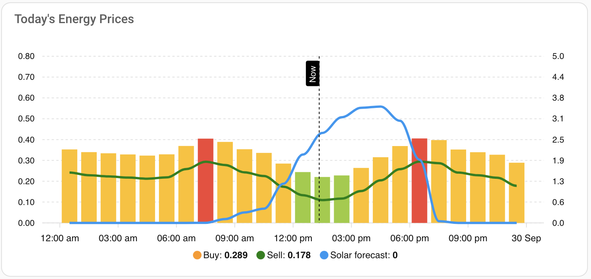

# Frank Energie for Home Assistant

[](https://github.com/archofthings/home-assistant-frank-energie/releases)
[](https://hacs.xyz/docs/faq/custom_repositories)
[](https://github.com/archofthings/home-assistant-frank-energie/actions/workflows/ci.yaml)
[](https://www.home-assistant.io/)
[](https://analytics.home-assistant.io/)

A Home Assistant custom integration that brings [Frank Energie](https://www.frankenergie.nl/) electricity and gas prices into Home Assistant, with optional account data such as your monthly costs and invoices.

Use the price sensors to run appliances, charge a car or battery, or heat water when energy is cheapest.

> [!NOTE]
> This project continues [bajansen/home-assistant-frank_energie](https://github.com/bajansen/home-assistant-frank_energie), which is no longer actively maintained. See [Project history](#project-history).

## Contents

- [Features](#features)
- [Requirements](#requirements)
- [Installation](#installation)
- [Configuration](#configuration)
- [Sensors](#sensors)
- [Using the price list](#using-the-price-list)
- [The get_prices action](#the-get_prices-action)
- [Price analysis](#price-analysis)
- [Charts](#charts)
- [Upgrading from the original integration](#upgrading-from-the-original-integration)
- [Troubleshooting](#troubleshooting)
- [Development](#development)
- [Project history](#project-history)
- [Credits and license](#credits-and-license)

## Features

- **Current prices every 15 minutes**: all-in price, market price, price including tax, VAT, sourcing markup and energy tax, for electricity and gas.
- **Daily statistics**: lowest, highest and average price for today and tomorrow, the next price, and the lowest and highest price still to come.
- **`frank_energie.get_prices` action** that returns all known prices with their components, for scripts and automations.
- **Full price list** as an attribute, covering today and (once published, usually around 13:00) tomorrow.
- **No account needed** for public prices.
- **Optional login** for your personal contract prices, plus your monthly cost and invoice sensors.
- **Choose your delivery address** when your account has more than one, and change it later with **Reconfigure**.
- **Local or UTC times** for the price list, configurable per installation.
- **Choose your sensors**: turn groups of sensors (daily statistics, upcoming prices, price analysis, costs, usage) on or off, so you only get what you use.
- **Your usage and costs**: yesterday's and this month's electricity, gas and feed-in usage and costs from your Frank Energie account.
- **Price analysis**: every quarter hour labelled cheap, normal or expensive (optionally "cheap + solar"), the cheapest period of the length you choose, and chart-ready data. See [Price analysis](#price-analysis).
- **Diagnostics download** for bug reports, with tokens and personal details removed.
- **Keeps working through API hiccups**: if an update fails, the last prices stay available as long as they still cover the future. Tokens are renewed automatically, and you're only asked to log in again when that fails.
- **Netherlands and Belgium**: public fallback prices follow your account's country.

## Requirements

- Home Assistant **2026.9** or newer
- [HACS](https://hacs.xyz/) (recommended) for installation
- Optional: a Frank Energie account, for personal prices and cost sensors

## Installation

### HACS (recommended)

[](https://my.home-assistant.io/redirect/hacs_repository/?owner=archofthings&repository=home-assistant-frank-energie&category=integration)

Or add it by hand:

1. In HACS, open the menu (⋮) and choose **Custom repositories**.
2. Add `https://github.com/archofthings/home-assistant-frank-energie` with type **Integration**.
3. Search for **Frank Energie**, download it, and restart Home Assistant.

Releases are currently published as **pre-releases**. If HACS doesn't offer the newest one, open the integration in HACS, choose **Redownload**, and select the version.

### Manual

1. Download `frank_energie.zip` from the [latest release](https://github.com/archofthings/home-assistant-frank-energie/releases).
2. Extract it into `config/custom_components/frank_energie/` in your Home Assistant configuration folder.
3. Restart Home Assistant.

## Configuration

[](https://my.home-assistant.io/redirect/config_flow_start/?domain=frank_energie)

1. Go to **Settings → Devices & services → Add integration** and search for **Frank Energie**.
2. Choose whether to log in with your Frank Energie account:
   - **Without login** you get the public market prices.
   - **With login** you get your personal contract prices, plus the monthly cost and invoice sensors.
3. If you logged in and your account has more than one address in delivery, choose the address to use. With a single address this step is skipped. The entry is named after the address.
4. Individual sensors can be disabled or hidden afterwards.

**Changing the address:** open the integration under **Settings → Devices & services → Frank Energie**, open the menu (⋮) and choose **Reconfigure**.

If your login expires and can't be renewed automatically, Home Assistant asks you to **re-authenticate** from **Settings → Devices & services**.

> [!IMPORTANT]
> The old `configuration.yaml` setup is no longer supported. Remove any `frank_energie` YAML configuration and set the integration up through the UI.

### Options

Choose **Configure** on the integration. The settings have up to two pages.

**Page 1: time zone and sensor groups**

| Option | Choices | Default |
|---|---|---|
| **Time zone for price times** | Home Assistant's time zone, or UTC | Home Assistant's time zone for new installations; UTC for installations set up before this option existed |
| **Sensor groups** | Tick the groups you want (see below) | New installations: daily statistics and costs. Installations set up before this option existed: all groups |

| Sensor group | Entities |
|---|---|
| *Current prices* | Always available: current all-in, market and including-tax prices (and the hidden VAT, markup and tax sensors) for electricity and gas |
| **Daily statistics** | Lowest, highest and average price today |
| **Upcoming and tomorrow prices** | Next price; average, lowest and highest price tomorrow; lowest and highest upcoming price; average gas price tomorrow |
| **Price analysis** | Price level, cheap price now, cheapest period now, next cheapest period, price analysis today and tomorrow (see [Price analysis](#price-analysis)) |
| **Costs and invoices** | Monthly cost and invoice sensors (only offered when you're logged in) |
| **Daily usage and costs (yesterday)** | Yesterday's electricity, gas and feed-in usage and costs, with hourly detail (only offered when you're logged in; off by default) |
| **Monthly usage and costs** | This month's electricity, gas and feed-in usage and costs, with expected values (only offered when you're logged in; off by default) |

When you untick a group, its entities are removed from Home Assistant after saving. Their history stays in the database; when you tick the group again, the entities come back with the same entity IDs and their history continues. The `get_prices` action is always available.

**Page 2: price analysis settings** (only shown when *Price analysis* is ticked)

The two sections are independent calculations:

| Section | Option | Choices | Default |
|---|---|---|---|
| **Price levels (fixed prices)** | **Cheap price below** | €/kWh (all-in) | €0.25 |
| | **Expensive price above** | €/kWh (all-in); must be higher than the cheap price | €0.40 |
| | **Solar forecast** | Any installed integration that provides the Energy dashboard's solar forecast (for example Forecast.Solar or Solcast), or none | None |
| | **Solar threshold** | kWh per hour | 1.5 |
| **Cheapest period (relative)** | **Cheapest period length** | 15 minutes to 6 hours, in steps of 15 minutes | 2 hours |

*Price levels* label every quarter hour as cheap, normal or expensive using your fixed prices; on an expensive day nothing is cheap. The *cheapest period* always finds the cheapest block of the chosen length, whatever the price. If you untick *Price analysis*, these settings are kept for when you turn it back on, and the analysis isn't calculated at all.

The time zone option sets the notation of the times in the `prices` list, the `from_time` attributes and the `get_prices` action. The moments are the same either way: `2026-09-28T10:00:00+02:00` and `2026-09-28T08:00:00+00:00` are the same time. See [Switching the time zone](#switching-the-time-zone) before changing it if automations read these times.

#### Switching the time zone

Installations set up before the time zone option existed keep UTC times, so existing automations keep working. Before switching to Home Assistant's time zone, check automations, templates and Node-RED flows that read the `prices` list or `from_time`:

- **Safe:** anything that parses the full time including its offset, such as `as_timestamp()`, `as_datetime()`, comparisons with `now()` in templates, `new Date(...)` or `moment(...)` in Node-RED, and ApexCharts.
- **Needs adjusting:** anything that assumes the text is UTC, such as adding a fixed 1 or 2 hours, cutting the hour out of the text (`substring`, `slice`), replacing `+00:00`, or comparing the text with other UTC text.

## Sensors

Prices are fetched every hour. From 12:00 (Europe/Amsterdam) until tomorrow's prices are published, usually around 13:00, the integration checks every 15 minutes, so tomorrow's prices show up soon after publication. Sensor states switch at every quarter hour (:00, :15, :30, :45) to the price of the current 15-minute slot.

Which of these sensors exist depends on the [sensor groups](#options) you've selected.

### Electricity (€/kWh)

| Sensor | Enabled by default | `prices` attribute |
|---|:---:|:---:|
| Current electricity price (All-in) | ✅ | ✅ |
| Current electricity market price | ✅ | ✅ |
| Current electricity price including tax | ✅ | ✅ |
| Current electricity VAT price | – | |
| Current electricity sourcing markup | – | |
| Current electricity tax only | – | |
| Lowest energy price today | ✅ | |
| Highest energy price today | ✅ | |
| Average electricity price today | ✅ | |
| Next electricity price (All-in) | ✅ | |
| Average electricity price tomorrow | ✅ | |
| Lowest electricity price tomorrow | ✅ | |
| Highest electricity price tomorrow | ✅ | |
| Lowest upcoming electricity price | ✅ | |
| Highest upcoming electricity price | ✅ | |

### Gas (€/m³)

| Sensor | Enabled by default | `prices` attribute |
|---|:---:|:---:|
| Current gas price (All-in) | ✅ | ✅ |
| Current gas market price | ✅ | ✅ |
| Current gas price including tax | ✅ | ✅ |
| Current gas VAT price | – | |
| Current gas sourcing price | – | |
| Current gas tax only | – | |
| Lowest gas price today | ✅ | |
| Highest gas price today | ✅ | |
| Average gas price tomorrow | ✅ | |

The lowest, highest and next price sensors have a `from_time` attribute with the start of that slot. *Upcoming* means slots that start after now, today and tomorrow. The tomorrow sensors are unavailable until tomorrow's prices are published.

### Costs (€, login required)

| Sensor | Description |
|---|---|
| Actual monthly cost | Costs so far this month, up to the last meter reading (`Last update` attribute) |
| Expected monthly cost until now | Expected costs up to the last meter reading |
| Expected cost this month | Expected costs for the whole month |
| Invoice previous period | Previous invoice (`Start date` and `Description` attributes) |
| Invoice current period | Current invoice period |
| Invoice upcoming period | Upcoming invoice |

### Usage and costs (€, login required)

Turn on the **Daily usage and costs (yesterday)** and **Monthly usage and costs** groups under [Configure](#options). The data is fetched every 3 hours.

| Sensor | Unit | Group | Attributes |
|---|---|---|---|
| Electricity usage yesterday | kWh | Daily | `date`, `hours` |
| Electricity costs yesterday | € | Daily | `date`, `hours` |
| Gas usage yesterday | m³ | Daily | `date`, `hours` |
| Gas costs yesterday | € | Daily | `date`, `hours` |
| Feed-in yesterday | kWh | Daily | `date`, `hours` |
| Feed-in revenue yesterday | € | Daily | `date`, `hours` |
| Electricity usage this month | kWh | Monthly | `expected_usage`, `last_meter_reading` |
| Electricity costs this month | € | Monthly | `expected_costs`, `average_price`, `last_meter_reading` |
| Gas usage this month | m³ | Monthly | `expected_usage`, `last_meter_reading` |
| Gas costs this month | € | Monthly | `expected_costs`, `average_price`, `last_meter_reading` |
| Feed-in this month | kWh | Monthly | `expected_usage`, `last_meter_reading` |
| Feed-in revenue this month | € | Monthly | `expected_costs`, `average_price`, `last_meter_reading` |
| Fixed costs this month (expected) | € | Monthly | — |

- The **daily** sensors show **yesterday**, because Frank Energie receives your smart meter data a day later. The `date` attribute says which day; `hours` lists the usage and costs per hour (not stored in history).
- Gas and feed-in sensors are only created when your account has gas or feed-in data.
- **Statistics:** the daily sensors record a new total each day. Because yesterday's data arrives today, Home Assistant's long-term statistics book each day's value **one day late**. The monthly sensors restart at the beginning of each month. For the Energy dashboard, keep using your own meter (for example a P1 meter); these sensors are meant for dashboards, notifications and comparing with your Frank Energie app.

A sensor shows as **unavailable** when there's no data for it, for example when gas prices are missing, or there's no month summary yet for a new account.

## Using the price list

The all-in, market and including-tax sensors have a `prices` attribute. It lists every known 15-minute slot for today and tomorrow:

```yaml
prices:
  - from: 2026-09-28T10:00:00+00:00
    till: 2026-09-28T10:15:00+00:00
    price: 0.245
  - from: 2026-09-28T10:15:00+00:00
    till: 2026-09-28T10:30:00+00:00
    price: 0.240
  # ...
```

Times follow the [time zone option](#options) (UTC in this example) and prices are rounded to 3 decimals. With tomorrow's prices included the list holds up to 200 entries, so it's **not stored in the recorder history**, to stay within Home Assistant's attribute size limit. It is always available on the live state, in templates and in dashboards.

The examples below use `sensor.frank_energie_prices_current_electricity_price_all_in`, the entity ID of a new installation. Installations upgraded from the original integration keep their older IDs without the `frank_energie_prices_` prefix (for example `sensor.current_electricity_price_all_in`); check yours under **Settings → Devices & services → Frank Energie**.

Highest price still to come:

```jinja
{{ state_attr('sensor.frank_energie_prices_current_electricity_price_all_in', 'prices')
   | selectattr('from', 'gt', now()) | max(attribute='price') }}
```

Lowest price today:

```jinja
{{ state_attr('sensor.frank_energie_prices_current_electricity_price_all_in', 'prices')
   | selectattr('from', 'ge', today_at('00:00'))
   | selectattr('till', 'le', today_at('00:00') + timedelta(days=1))
   | min(attribute='price') }}
```

Lowest price in the next six hours:

```jinja
{{ state_attr('sensor.frank_energie_prices_current_electricity_price_all_in', 'prices')
   | selectattr('from', 'gt', now())
   | selectattr('till', 'lt', now() + timedelta(hours=6))
   | min(attribute='price') }}
```

## The get_prices action

`frank_energie.get_prices` returns the known prices (today, and tomorrow once published) for scripts and automations. It uses the prices already loaded by the integration, so it doesn't call the Frank Energie API.

| Field | Required | Description |
|---|:---:|---|
| `config_entry_id` | ✅ | Your Frank Energie integration entry |
| `start` | | Only return slots that end after this time |
| `end` | | Only return slots that start before this time |

Each slot in the `electricity` and `gas` lists contains `start`, `end`, `price` (all-in), `market_price`, `market_price_including_tax`, `vat`, `sourcing_markup` and `energy_tax`. Times follow the [time zone option](#options).

Example: find the cheapest quarter hour in the next 6 hours.

```yaml
action:
  - action: frank_energie.get_prices
    data:
      config_entry_id: YOUR_ENTRY_ID
      start: "{{ now() }}"
      end: "{{ now() + timedelta(hours=6) }}"
    response_variable: frank
  - variables:
      cheapest: "{{ frank.electricity | min(attribute='price') }}"
  - action: notify.notify
    data:
      message: "Cheapest at {{ cheapest.start }}: € {{ cheapest.price }}/kWh"
```

In the Developer tools → **Actions** tab, pick the entry from the list to find its ID.

## Price analysis

The price analysis answers two different questions about electricity prices:

1. **Is the price cheap right now?** Every 15-minute slot gets a *level* based on fixed prices you choose under [Options](#options):

   | Level | Meaning |
   |---|---|
   | `cheap_solar` | Cheap, and the solar forecast for that hour is at or above your solar threshold |
   | `cheap` | All-in price at or below **Cheap price below** |
   | `normal` | Between the two thresholds |
   | `expensive` | All-in price above **Expensive price above** |

2. **When is the cheapest period?** The integration finds the consecutive block of **Cheapest period length** (for example 2 hours) with the lowest average price, whatever the absolute price is. It does this for today, for tomorrow, and from now onwards. Use it to start the dishwasher, washing machine or car charging at the cheapest moment.

### Entities

| Entity | State | Use it for |
|---|---|---|
| **Electricity price level** | `cheap_solar`, `cheap`, `normal` or `expensive` for the current slot | Dashboards, conditions |
| **Cheap electricity price now** | On while the current slot is `cheap` or `cheap_solar` | Automations that run whenever power is cheap |
| **Cheapest electricity period now** | On during today's cheapest period | Automations that run once a day at the cheapest moment |
| **Next cheapest electricity period** | Start time of the next cheapest period (may be tomorrow) | Planning, notifications |
| **Electricity price analysis today** | Start time of today's cheapest period | Charts (see below) |
| **Electricity price analysis tomorrow** | Start time of tomorrow's cheapest period; unavailable until tomorrow's prices are published | Charts |

**Next cheapest electricity period** has the attributes `end`, `average_price` and `minutes`.

The two analysis sensors have these attributes. They're not stored in the recorder history, and their times follow the [time zone option](#options):

| Attribute | Content |
|---|---|
| `slots` | One entry per 15-minute slot: `from`, `till`, `price`, `level`, `solar_kwh`, `in_cheapest_period`, `is_current` |
| `cheapest_period` | `start`, `end`, `average_price`, `minutes` |
| `cheap_windows`, `expensive_windows` | Consecutive cheap or expensive slots: `start`, `end`, `average_price`, `minutes` |
| `solar_windows` | Consecutive `cheap_solar` slots, also with `average_solar_kwh` |
| `thresholds` | The `cheap`, `expensive` and `solar_kwh` values used |

### Charts: prices coloured by level

These [ApexCharts Card](https://github.com/RomRider/apexcharts-card) charts show the prices as columns coloured by level (yellowgreen = cheap + solar, green = cheap, yellow = normal, red = expensive), with the solar forecast as a blue line on the right axis. The entity IDs are those of a new installation; replace them if yours differ.

Tips that avoid common problems with this card:
- Use **one** column series with a `colorMap` and `fillColor`. Separate column series per level make the bars very narrow.
- Don't use `null` values or an `area` series in `data_generator`; the card then stays on "Loading".
- The `+ 30 * 60 * 1000` centres the columns for **hourly** prices. With 15-minute prices, use `+ 7.5 * 60 * 1000` (and the same value in the tooltip).

#### Today



The optional **Sell** line shows the price minus a fixed amount (here 0.11085) for feed-in; adjust or remove it.

```yaml
type: custom:apexcharts-card
header:
  show: true
  title: Today's Energy Prices
graph_span: 24h
span:
  start: day
now:
  show: true
  color: black
  label: Now
yaxis:
  - id: price
    decimals: 2
    min: 0
    max: 0.8
    apex_config:
      tickAmount: 8
  - id: solar
    opposite: true
    decimals: 1
    min: 0
    max: 5
series:
  - entity: sensor.frank_energie_prices_electricity_price_analysis_today
    name: Price
    type: column
    yaxis_id: price
    float_precision: 3
    data_generator: >
      if (!entity.attributes.slots || entity.attributes.slots.length === 0) {
        return [{ x: Date.now(), y: 0 }];
      }

      const colorMap = { cheap_solar: 'yellowgreen', cheap: 'green', normal:
      '#FFC107', expensive: '#F44336' };

      return entity.attributes.slots.map((p) => {
        const centeredX = new Date(p.from).getTime() + 30 * 60 * 1000;
        return { x: centeredX, y: p.price, fillColor: colorMap[p.level] };
      });
  - entity: sensor.frank_energie_prices_electricity_price_analysis_today
    name: Sell
    type: line
    color: green
    yaxis_id: price
    float_precision: 3
    stroke_width: 3
    data_generator: >
      if (!entity.attributes.slots || entity.attributes.slots.length === 0) {
        return [{ x: Date.now(), y: 0 }];
      }

      return entity.attributes.slots.map((p) => {
        const centeredX = new Date(p.from).getTime() + 30 * 60 * 1000;
        return { x: centeredX, y: p.price - 0.11085 };
      });
  - entity: sensor.frank_energie_prices_electricity_price_analysis_today
    name: Solar forecast
    type: line
    yaxis_id: solar
    color: '#2196F3'
    stroke_width: 3
    data_generator: >
      if (!entity.attributes.slots || entity.attributes.slots.length === 0) {
        return [{ x: Date.now(), y: 0 }];
      }

      return entity.attributes.slots.map((p) => {
        const centeredX = new Date(p.from).getTime() + 30 * 60 * 1000;
        return { x: centeredX, y: p.solar_kwh };
      });
apex_config:
  chart:
    height: 220
  xaxis:
    labels:
      datetimeUTC: false
  plotOptions:
    bar:
      columnWidth: 80%
  tooltip:
    x:
      formatter: |
        EVAL:function(val) {
          const realStart = new Date(val - 30 * 60 * 1000);
          return realStart.toLocaleString('nl-NL', { day: 'numeric', month: 'short', hour: '2-digit', minute: '2-digit' });
        }
grid_options:
  columns: 24
  rows: auto
```

#### Tomorrow

<!-- Screenshot: images/prices_tomorrow.png -->

The chart stays empty until tomorrow's prices are published.

```yaml
type: custom:apexcharts-card
header:
  show: true
  title: Tomorrow's Energy Prices
graph_span: 24h
span:
  start: day
  offset: +1d
yaxis:
  - id: price
    decimals: 2
    min: 0
    max: 0.8
    apex_config:
      tickAmount: 8
  - id: solar
    opposite: true
    decimals: 1
    min: 0
    max: 5
series:
  - entity: sensor.frank_energie_prices_electricity_price_analysis_tomorrow
    name: Price
    type: column
    yaxis_id: price
    float_precision: 3
    data_generator: >
      if (!entity.attributes.slots || entity.attributes.slots.length === 0) {
        return [{ x: Date.now(), y: 0 }];
      }

      const colorMap = { cheap_solar: 'yellowgreen', cheap: 'green', normal:
      '#FFC107', expensive: '#F44336' };

      return entity.attributes.slots.map((p) => {
        const centeredX = new Date(p.from).getTime() + 30 * 60 * 1000;
        return { x: centeredX, y: p.price, fillColor: colorMap[p.level] };
      });
  - entity: sensor.frank_energie_prices_electricity_price_analysis_tomorrow
    name: Solar forecast
    type: line
    yaxis_id: solar
    color: '#2196F3'
    stroke_width: 3
    data_generator: >
      if (!entity.attributes.slots || entity.attributes.slots.length === 0) {
        return [{ x: Date.now(), y: 0 }];
      }

      return entity.attributes.slots.map((p) => {
        const centeredX = new Date(p.from).getTime() + 30 * 60 * 1000;
        return { x: centeredX, y: p.solar_kwh };
      });
apex_config:
  chart:
    height: 220
  xaxis:
    labels:
      datetimeUTC: false
  plotOptions:
    bar:
      columnWidth: 80%
  tooltip:
    x:
      formatter: |
        EVAL:function(val) {
          const realStart = new Date(val - 30 * 60 * 1000);
          return realStart.toLocaleString('nl-NL', { day: 'numeric', month: 'short', hour: '2-digit', minute: '2-digit' });
        }
grid_options:
  columns: 24
  rows: auto
```

### Automation examples

Start the dishwasher at the beginning of today's cheapest period:

```yaml
triggers:
  - trigger: state
    entity_id: binary_sensor.frank_energie_prices_cheapest_electricity_period_now
    to: "on"
actions:
  - action: switch.turn_on
    target:
      entity_id: switch.dishwasher
```

Charge the home battery whenever the price is cheap:

```yaml
triggers:
  - trigger: state
    entity_id: binary_sensor.frank_energie_prices_cheap_electricity_price_now
    to: ["on", "off"]
actions:
  - action: "switch.turn_{{ trigger.to_state.state }}"
    target:
      entity_id: switch.battery_charging
```

The entity IDs in these examples may differ in your installation; check them under **Settings → Devices & services → Frank Energie**.

### Solar forecast

To use `cheap_solar`, choose a solar forecast under **Configure**. The list shows the integrations that provide a solar forecast for the Energy dashboard. The forecast is read from that integration each time the analysis is recalculated, so it adds no extra internet traffic. Without a solar forecast, slots are never labelled `cheap_solar`.

## Charts

The price list can be plotted with [ApexCharts Card](https://github.com/RomRider/apexcharts-card).

### Today and tomorrow


```yaml
type: custom:apexcharts-card
graph_span: 48h
span:
  start: day
now:
  show: true
  label: Now
header:
  show: true
  title: Electricity price per 15 minutes (€/kWh)
series:
  - entity: sensor.frank_energie_prices_current_electricity_price_all_in
    show:
      legend_value: false
    stroke_width: 2
    float_precision: 3
    type: column
    opacity: 0.3
    color: '#03b2cb'
    data_generator: |
      return entity.attributes.prices.map((record) => [record.from, record.price]);
```

### Next hours


```yaml
type: custom:apexcharts-card
graph_span: 14h
span:
  start: hour
  offset: '-3h'
now:
  show: true
  label: Now
header:
  show: true
  show_states: true
  colorize_states: true
yaxis:
  - decimals: 2
    min: 0
    max: '|+0.10|'
series:
  - entity: sensor.frank_energie_prices_current_electricity_price_all_in
    show:
      in_header: raw
      legend_value: false
    stroke_width: 2
    float_precision: 4
    type: column
    opacity: 0.3
    color: '#03b2cb'
    data_generator: |
      return entity.attributes.prices.map((record) => [record.from, record.price]);
```

## Upgrading from the original integration

**Switching an existing HACS installation:**

1. In HACS, open **Frank Energie** and choose **Remove**. This removes the integration's files only; your configured integration, entities and history stay in Home Assistant.
2. Remove the old repository from **Custom repositories**: `https://github.com/bajansen/home-assistant-frank_energie`, or `https://github.com/archofthings/home-assistant-frank_energie` if you installed the earlier fork.
3. Add this repository and download it as described under [Installation](#installation).
4. Restart Home Assistant.

**What changes:**

- **Home Assistant 2026.9 or newer** is required.
- **Prices are per 15 minutes** instead of per hour. Automations and templates that assume hourly values, or 24 entries per day in `prices`, may need adjusting (a day now has 96 entries, or 92/100 on daylight-saving days).
- **Lowest and highest price today** now pick a 15-minute slot, so they can be more extreme than the old hourly values.
- **Existing entities keep their entity IDs and history**, because their unique IDs are unchanged.
- **The `prices` attribute is no longer stored in history**; see [Using the price list](#using-the-price-list).

## Troubleshooting

**HACS shows a download error (404).** The release has no `frank_energie.zip` attached. Pick a newer release in HACS.

**Sensors are unavailable.**
- *Just after midnight:* tomorrow's prices may not have been loaded yet. They're fetched hourly and normally published around 13:00.
- *Gas sensors:* if your contract has no gas, the gas sensors stay unavailable.

**Download diagnostics.** On the integration page, open the menu (⋮) and choose **Download diagnostics**. Tokens, your username, site reference and address are removed, so the file can be attached to an issue.

**Debug logging.** Add this to `configuration.yaml` and restart:

```yaml
logger:
  default: warning
  logs:
    custom_components.frank_energie: debug
    python_frank_energie: debug
```

> [!WARNING]
> Debug logs from `python_frank_energie` can contain your address and full price data. Remove personal details before sharing logs in an issue. The integration itself never logs your tokens or password.

Please report problems via [GitHub issues](https://github.com/archofthings/home-assistant-frank-energie/issues).

## Development

```text
custom_components/frank_energie/
├── __init__.py      # setup, delivery site discovery
├── config_flow.py   # UI setup, login, site choice, reauth, reconfigure, options
├── coordinator.py   # data fetching, fallbacks, token handling
├── diagnostics.py   # redacted diagnostics download
├── sensor.py        # sensor definitions
├── services.py      # get_prices action (services.yaml describes it)
├── sites.py         # delivery site filtering and titles
└── manifest.json    # pins python-frank-energie==2026.9.20
tests/               # pytest-homeassistant-custom-component tests (API fully mocked)
```

Run the checks locally with Python 3.14:

```bash
python3.14 -m venv .venv && source .venv/bin/activate
pip install -r requirements.txt
flake8 . --count --max-complexity=10 --max-line-length=120 --statistics
pytest
```

CI runs flake8 and pytest on every push and pull request. Publishing a GitHub release builds `frank_energie.zip` and attaches it to the release for HACS.

## Project history

This integration was created as [bajansen/home-assistant-frank_energie](https://github.com/bajansen/home-assistant-frank_energie) by [@bajansen](https://github.com/bajansen) and contributors, and was developed there until early 2025.

In 2026 Frank Energie changed its API, which broke the original integration. Development continued briefly in a GitHub fork (`archofthings/home-assistant-frank_energie`) and has since moved to this repository:

- moved to the new API (`python-frank-energie` 2026.9.20) and Frank Energie's 15-minute prices
- more robust error handling, automatic token renewal, and support for accounts without gas or outside the Netherlands
- a rewritten test suite and updated CI and release workflows

The full commit history of the original project is kept in this repository. The integration domain (`frank_energie`) and entity unique IDs are unchanged, so existing installations can switch to this repository without losing their entities or history (see [Upgrading from the original integration](#upgrading-from-the-original-integration)).

## Credits and license

- Original integration by [@bajansen](https://github.com/bajansen) and contributors.
- API client: [python-frank-energie](https://pypi.org/project/python-frank-energie/).

This project is not affiliated with or endorsed by Frank Energie.

The upstream project doesn't include a license file, so no license has been added here either.
